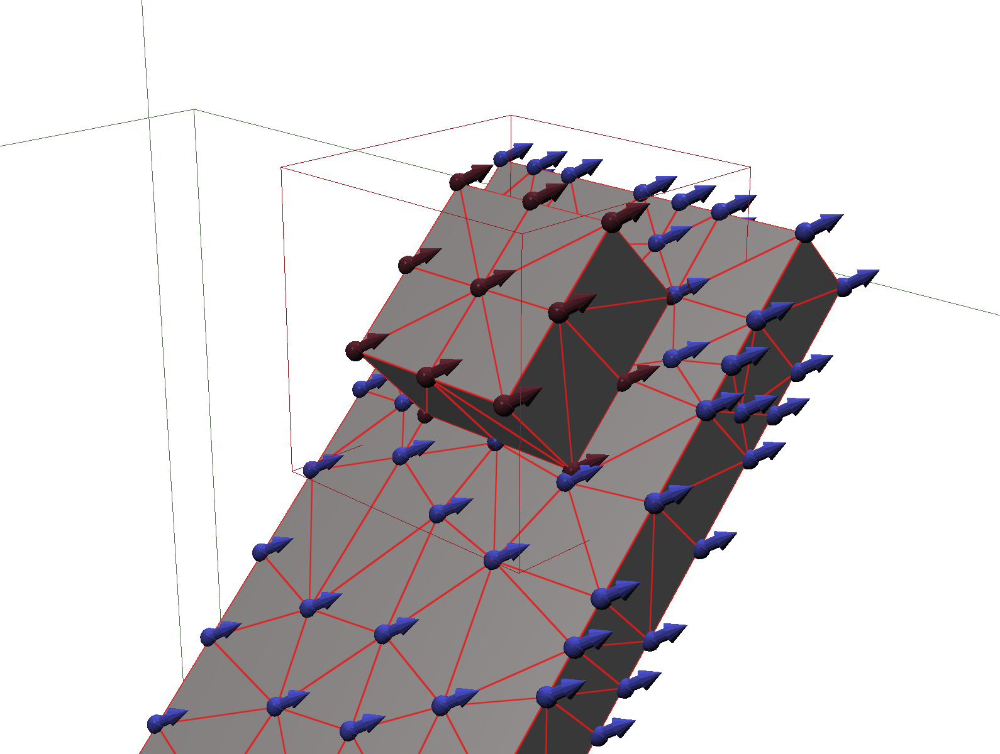
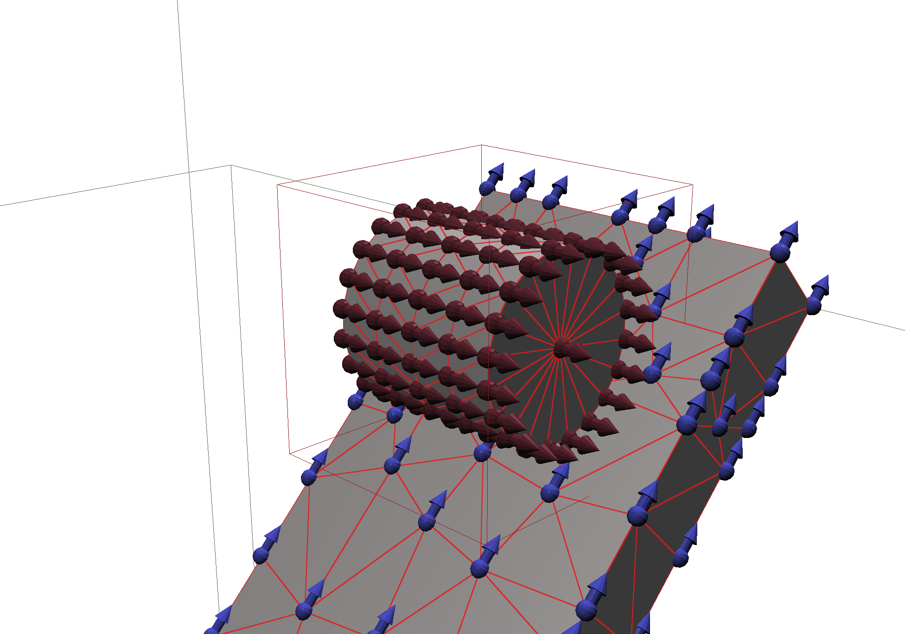
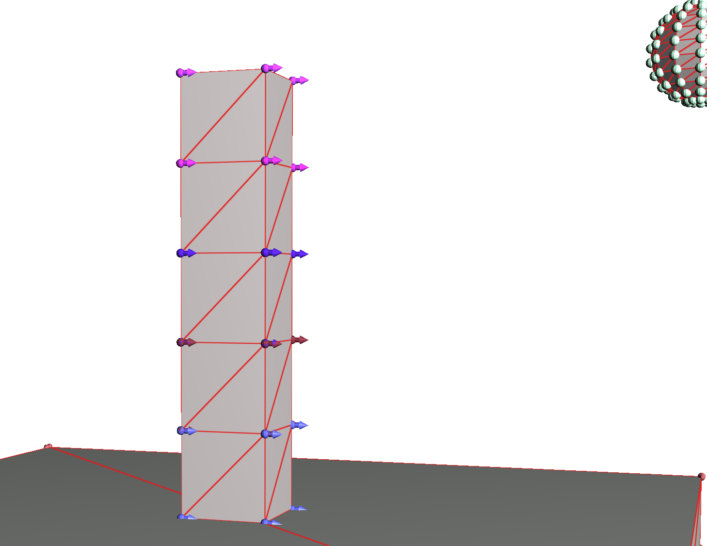
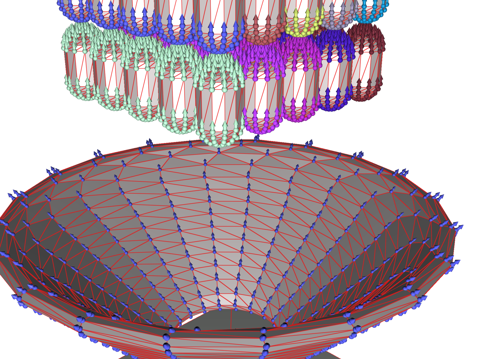

# PROX MATCHSTICK
Research related code demonstrating how anisotropic friction modelling can be incorporated into a proximal operator setting for solving contact forces with iterative methods. The code is based on the papers:

* Robert Schmidtke and Kenny Erleben. 2017. Chunked bounding volume hierarchies for fast digital prototyping using volumetric meshes. IEEE Trans. Vis. Comput. Graph. 99 (2017)
* Kenny Erleben, Rigid body contact problems using proximal operators, Proceedings of the ACM SIGGRAPH / Eurographics Symposium on Computer Animation, July 28-30, 2017, Los Angeles, California
* Kenny Erleben, Methodology for Assessing Mesh-Based Contact Point Methods, ACM Transactions on Graphics (TOG), v.37 n.3, August 2018

The code has been developed and tested using

* macOS Mojave ver 10.14.3.
* CMake ver 3.13.3
* Xcode ver 10.1
* Macport 2.5.4 (for installing Boost, Glew and Qt)

Dependencies can be installed as follows

```bash
sudo port install python37
sudo port install boost @1.66.0_3+no_single-no_static+python37
sudo port install glew @2.1.0
sudo port install qt5 @5.12.0
```

## How to Compile and Link

CMake should be used for generating make/solution files.

* Open the cmake gui application

* Browse the source path to the top most folder containing a CMakeLists.txt file.

* For binary destination use the same folder location but add a subfolder to contain the binary tree. You can name it whatever you want. For instance "build". Press configure button, resolve any conflicts or issues.

* If you want to have unit-testing find the cmake variable ENABLE_UNIT_TESTS and set it to true (=1)

* Press configure button again until no red variables appear. Now press generate button.

* Goto the build folder and locate your solution/make files and use these to compile and link the sub project.

## Test Scenes
This section  gives a brief overview of how to run the default test scenes and play with changing parameters controlling their behaviour.

We have five test configurations

* Box on inclined Plane
* Rolling Cylinder
* Arch
* Stack
* Hopper with Capsules

The friction and simulator behaviour can  be controlled by changing parameter values in the configuration files that resides inside the bin folder.

### Box on Incline Plane
Pressing keyboard key "1" initialises the rolling cylinder on inclined plane configuration. Pressing "X" toggles displaying structure fields. The structure fields can be fine tuned in the configuration file named

[bin/scene_01_box_on_inclined_plane.cfg](bin/scene_01_box_on_inclined_plane.cfg)

This is a simple test scene that allows to observe different sliding trajectories for various settings of the structure field directions.

<center>
<table>
<tr align=center>
<td>

</td>
</tr>
<tr align=center>
<td>
Box and Cylinder (1,0,1)
</td>
</tr>
</table>
</center>

### Rolling Cylinder
Pressing keyboard key "2" initialises the rolling cylinder on inclined plane configuration. Pressing "X" toggles displaying structure fields. The structure fields can be fine tuned in the configuration file named

[bin/scene_02_rolling_cylinder.cfg](bin/scene_02_rolling_cylinder.cfg)

Two different structure field directions are displayed below.

<center>
<table>
<tr align=center>
<td>

</td>
<td>

</td>
</tr>
<tr align=center>
<td>
Cylinder (0,0,1)
</td>
<td>
Cylinder (0,1,0)
</td>
</tr>
</table>
</center>

The current frictional model in this PROX framework supports planar friction and torque (drilling) friction. Hence, for rolling friction there should be no effect of changing the structure field directions. The cylinder should roll in a similar fashion in both scenarios.

<center>
<table>
<tr align=center>
<td>
Cylinder vs Plane
</td>
<td>
(1,0,0)
</td>
<td>
(1,0,1)
</td>
</tr>
<tr align=center>
<td>(0,0,1)</td>
<td>

</td>
<td>

</td>
</tr>
<td>(0,1,0)</td>
<td>

</td>
<td>

</td>
</tr>
</table>
</center>

### Arch
Pressing keyboard key "3" initialises the arch configuration. Pressing "X" toggles displaying structure fields. The structure fields can be fine tuned in the configuration file named

[bin/scene_03_arch.cfg](bin/scene_03_arch.cfg)

Two different structure field directions are displayed below.

<center>
<table>
<tr align=center>
<td>

</td>
<td>

</td>
</tr>
<tr align=center>
<td>
Arch (0,0,1)
</td>
<td>
Arch (0,1,0)
</td>
</tr>
</table>
</center>

On the left the structure directions are orthogonal to the gravity direction. This means a stronger frictional resistance in the gravity direction. On the right the radial structure field directions are more aligned with gravity meaning that keystones can more easily slide in the gravity direction. The arch will break in both scenarios but with different behaviours. On the left pillars will be pushed sideways out and the whole arch will come down once the pillar support is done. On the right the arch will break first by key stones sliding out of place in the radial directions.

One can change the configuration to remove the pillars (set the pillar segment parameter to zero in the cfg file) in which case the structure field directions on the left are more easily made stable (arch not moving) and the one on the right will fall apart.


### Stack
Pressing keyboard key "4" initialises the stack configuration. Pressing "X" toggles displaying structure fields. The structure fields can be fine tuned in the configuration file named

[bin/scene_04_stack.cfg](bin/scene_04_stack.cfg)

Two different structure field directions are displayed below.

<center>
<table>
<tr align=center>
<td>

</td>
<td>

</td>
</tr>
<tr align=center>
<td>
Stack (1,0,0)
</td>
<td>
Stack (0,0,1)
</td>
</tr>
</table>
</center>

On the left the stack structure field directions are aligned with the velocity of the sphere that moves towards the stack. This will make stack boxes more easily pushed off the stack. Resulting in a more localised impact effect that does not change the part of the stack below the impact much. On the right the structure field is orthogonal to the motion of the hitting sphere. In this case the boxes can resist the impact more and the impact will be distributed more to all boxes.

### Hopper with Capsules
Pressing keyboard key "5" initialises the capsules and hopper configuration. Pressing "X" toggles displaying structure fields. The structure fields can be fine tuned in the configuration file named

[bin/scene_05_capsule_hopper.cfg](bin/scene_05_capsule_hopper.cfg)

Two different structure field directions are displayed below.

<center>
<table>
<tr align=center>
<td>

</td>
<td>

</td>
</tr>
<tr align=center>
<td>
Funnel (0,0,1) Capsule (0,1,0)
</td>
<td>
Funnel (1,1,0) Capsule (0,0,1)
</td>
</tr>
</table>
</center>

Notice that on left the structure field directions forms concentric circles inside the funnel. Imagine the structure fields are indicating micro-scale groves. Hence in this configuration the funnel will more strongly resist sliding motion through the funnel. On the right the structure field directions form radial lines such that the groves make it easier to slide through the funnel. Similar of the left the capsule have radial directions suggesting it like to slide along the longest direction and on the right it has concentric directions giving more resistance to sliding along its longest direction.


<center>
<table>
<tr align=center>
<td>

</td>
</tr>
<tr align=center>
<td>
Simulation of multiple capsules and funnel using radial patterns on both types of geometries. Funnel (1,1,0) Capsules (0,1,0).
</td>
</tr>
</table>
</center>


## Tweaking Friction Behaviour
Besides controlling the structure field directions one can also change the values of the coefficients of friction. This is done in the configuration files by locating the parameter values

```ini
procedural_param_10   = 0.25   # mu_iso
procedural_param_11   = 0.25   # mu_ani_s
procedural_param_12   = 0.25   # mu_ani_t
procedural_param_13   = 0.25   # mu_ani_n
```

The parameter numbers may vary in different configuration files so the comments are more useful for location the parameters. The settings above are form the arch configuration file and their values give a isotropic material that will ignore the structure field directions. Changing the settings into

```ini
procedural_param_10   = 0.25   # mu_iso
procedural_param_11   = 0.25   # mu_ani_s
procedural_param_12   = 3.0    # mu_ani_t
procedural_param_13   = 0.1    # mu_ani_n
```

Create an anisotropic friction model that in the extreme case have very low planar friction in the structure field direction (the s-direction) and strong planar friction in the orthogonal structure field direction.

## Tweaking Simulator Behaviour

Inside the configuration files one can locate a set of variables that control the simulator.

One can set the total simulated time, the time-step size as well as the overall method choices. Below is shown some typical settings.

```ini
total_time            = 4.0
time_step             = 0.01
absolute_tolerance    = 0.0
relative_tolerance    = 0.0
solver                = gauss_seidel
contact_algorithm     = opposing
friction_sub_solver   = numerical_ellipsoid
max_iteration         = 500
```

If one wishes to have a faster simulator then one can increase the absolute and relative tolerance to allow for an early exit of the solver or clamping the maximum iteration count to more strongly enforce not spending too many iterations in the contact solver.

If more accurate results are desried then one should decrease the time-step size and increase the number of iterations. Setting the tolerance values to zero has the effect of forcing the contact solver to run all maximum iterations. This type of setting is often used for testing and/or profiling scenes, or to ensure a fair comparison between different settings and/or solvers.

The configuration files support important other configuration files. For instance the file configuration file named, setup_default_simulation.cfg contains many more details on various simulation parameters. This setup file are imported into all scenes files and then parameter values that is changed are simply overridden by providing a new assignment after the import or last setting of the parameter value.

## Summary of Scene Settings

The table below contains the simulator parameter settings currently used.

<table>
<tr>
<td>
Scene
</td>
<td>
Total Time (s)
</td>
<td>
Time Step (s)
</td>
<td>
Max. Iterations (#)
</td>
<td>
Absolute Tolerance
</td>
<td>
Relative Tolerance
</td>
</tr>

<tr>
<td>Box on Inclined Plane</td>
<td>
2.5
</td>
<td>
0.01
</td>
<td>
100
</td>
<td>
0
</td>
<td>
0
</td>
</tr>

<tr>
<td>Rolling Cylinder</td>
<td>
4
</td>
<td>
0.01
</td>
<td>
500
</td>
<td>
0
</td>
<td>
0
</td>
</tr>

<tr>
<td>Arch</td>
<td>
4
</td>
<td>
0.01
</td>
<td>
100
</td>
<td>
0
</td>
<td>
0
</td>
</tr>

<tr>
<td>Stack</td>
<td>
4
</td>
<td>
0.01
</td>
<td>
500
</td>
<td>
0
</td>
<td>
0
</td>
</tr>

<tr>
<td>Hopper with Capsules</td>
<td>
10
</td>
<td>
0.01
</td>
<td>
100
</td>
<td>
0
</td>
<td>
0
</td>
</tr>
</table>

The following table specifies the friction model parameter that was used in the examples.

<table>
<tr>
<td>
Scene
</td>
<td>
mu isotropic
</td>
<td>
mu anisotropic s
</td>
<td>
mu anisotropic t
</td>
<td>
mu anisotropic n
</td>
</tr>

<tr>
<td>Box on Inclined Plane</td>
<td>
0.2
</td>
<td>
0.2
</td>
<td>
3.0
</td>
<td>
0.1
</td>
</tr>

<tr>
<td>Rolling Cylinder</td>
<td>
0.2
</td>
<td>
0.2
</td>
<td>
3.0
</td>
<td>
0.1
</td>
</tr>

<tr>
<td>Arch</td>
<td>
0.25
</td>
<td>
0.25
</td>
<td>
3.0
</td>
<td>
0.1
</td>
</tr>

<tr>
<td>Stack</td>
<td>
0.1
</td>
<td>
0.1
</td>
<td>
3.0
</td>
<td>
0.1
</td>
</tr>

<tr>
<td>Hopper with Capsules</td>
<td>
0.2
</td>
<td>
0.2
</td>
<td>
3.0
</td>
<td>
0.1
</td>
</table>


## Getting Overview of the Code

The actual matchstick model is implemented in a single file

[prox_matchstick_model.h](https://github.com/diku-dk/matchstick/blob/master/PROX/SIMULATION/PROX/PROX/include/prox_matchstick_model.h)

In this file the method "compute_coefficients_of_friction" and "compute_contact_frame" gives the core functionality that generates the coefficient and orientation of the anisotropic friction cone.

These functions are used respectively in the files

[prox_get_friction_coefficient_vector.h](https://github.com/diku-dk/matchstick/blob/master/PROX/SIMULATION/PROX/PROX/include/prox_get_friction_coefficient_vector.h)
[prox_get_jacobian_matrix.h](https://github.com/diku-dk/matchstick/blob/master/PROX/SIMULATION/PROX/PROX/include/prox_get_jacobian_matrix.h)

The first file implements a function that assembles a vector of friction coefficients and the other file implements a function that assembles a Jacobian matrix. These two functions are invoked in a time-stepper before invoking the contact force solver. A time stepper implementation can be seen in this file

[prox_moreau_time_stepper.h](https://github.com/diku-dk/matchstick/blob/master/PROX/SIMULATION/PROX/PROX/include/steppers/prox_moreau_time_stepper.h)

The stepper invokes a prox solver function after having assembled all the data needed that defines the contact force problem. A typical Gauss-Seidel type of solver can be seen in the file

[prox_gauss_seidel_solver.h](https://github.com/diku-dk/matchstick/blob/master/PROX/SIMULATION/PROX/PROX/include/solvers/prox_gauss_seidel_solver.h)

Here the solver is simply one function that iterates over the contact points and invokes a proximal operator first on the normal block of the contact problem and then the friction block of the contact.

This code supports different types of steppers, solvers and sub-solvers (proximal operators). Template binders are used to setup the specific combination based on settings given in the cfg files located in the bin-folder.

### Some Design Notes

Current implementation assumes that the friction cone model only depends on positional information and that such information does not change during the prox solver invokation. This allows the model is be instanciated once in the assembly functions get_friction_coefficient_vector and get_jacobian_matrix. If a more implicit time-stepping scheme is chosen then positions and orientations could potentially change while iteration. This would be the case in a primal dual Newton type of approach. Such as the one presented in

* Miles Macklin, Kenny Erleben, Matthias Muller, Nuttapong Chentanez, Stefan Jeschke, and Viktor Makoviychuk: Non-Smooth Newton Methods for Deformable Multi-Body Dynamics, ACM TOG, 2019

This essential mean the friction cones could be changing while iterating in the contact solver.
